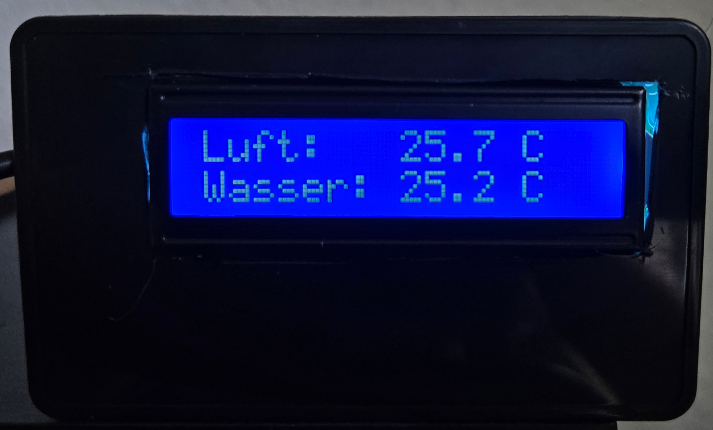
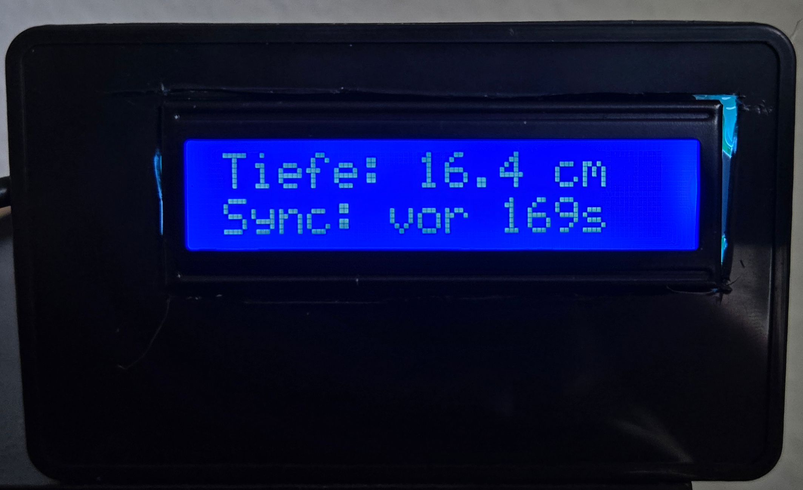
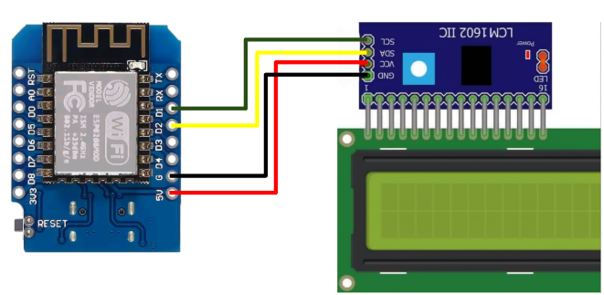

# 2x16 LCD-Display with esp8266
Having some fancy metrics in your Home Assistant is nice, but sometimes you want to make them accessible without your mobile device or tablet.

That’s why I came up with the idea to display some metrics on a small LCD display. In my case, I wanted to observe the water temperature, air temperature, and water level of my turtle aquarium.
## Result

## Preparation

### Stuff to Buy
1. ESP8266 board (D1 Mini)
2. Jumper cables for ESP
3. 2x16 LCD-Display with IIC Interface
4. Power adapter and micro-USB cable

### Software
I used ESPHome with Home Assistant.

## Step-by-Step Instructions

### 1. Wiring

| ESP 8266 D1 Mini | IIC Interface of LCD-Display |
|------------------|------------------------------|
| 5V               | VCC                          |
| GND              | GND                          |
| D2               | SDA                          |
| D1               | SCL                          |

### 2. Setup in ESPHome
1. Connect the wired ESP-Board to your Home Assistant via USB
2. Open "ESPHome Builder" (if not installed, see: [Installation](https://esphome.io/guides/getting_started_hassio.html))
3. Use "NEW DEVICE" and add a name for example "LcdAquarium8266"
4. Select "ESP8266"
5. Save the Encryption-Key in a safe space
6. Select "INSTALL"

You will now see the flashing and installation process of your ESP board.

### 3. Configuration with Code
ESPHome automatically generates a standard configuration for your ESP board.
Now we need to tell the board how to communicate with the LCD display and configure the wiring.

To edit the code, click EDIT on your new device in ESPHome.

You can use my code: [lcdaquarium8266.yaml](lcdaquarium8266.yaml)

#### Explanation:
You just have to add all the code below `# --------- custom code below here ---------`. Everything above is already set up by ESPHome during initial installation.

In my use case, I wanted to show three sensor states from Home Assistant and the last update time of one of them.
To make this work on a small screen, I added automatic pagination for those four values.

If your LCD display shows no output, the IIC address might be wrong (line 70 in the code).
To find the correct address, you can uncomment line 64:

`# scan: true # only necessary to find address, see below` 

and check the logs during reinstallation.

### 4. Getting States from Home Assistant
You might see `NaN` values instead of the actual sensor states from Home Assistant.
To allow the ESP board to access them, you must add the new device in Home Assistant.

Check Settings → Integrations and add your new sensor.

Now you can enjoy your LCD display showing live states from your Home Assistant.
